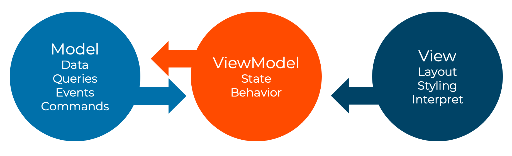

# Anatomy of a frontend

Frontend projects are a bit different in configuration, they typically use the WebPack Dev Server for running things and provide the same
feel of automatic compile and run on change.

## The entrypoint -template

The frontend needs a bit more artifacts in place for it to work.
We need an HTML template file for generating the entrypoint of the frontend, add a file called `index.ejs`:

```html
<!DOCTYPE html>
<html>

<head>
    <meta charset="utf-8" />
    <title><%- htmlWebpackPlugin.options.metadata.title %></title>
    <meta name="viewport" content="width=device-width, initial-scale=1">
    <base href="<%- htmlWebpackPlugin.options.metadata.baseUrl %>">
</head>

<body class="ms-Fabric">
    <div id="root"></div>
    <% if (htmlWebpackPlugin.options.metadata.server) { %>
    <!-- Webpack Dev Server reload -->
    <script src="/webpack-dev-server.js"></script>
    <% } %>
</body>

</html>
```

### Index.tsx

While the `index.ejs` file provides a template for generating the initial HTML file that will be hit when serving the solution.
It will in the built result contain a reference to the JavaScript bundle that makes up the application. The entrypoint of this
by default defined as the `index.tsx` file and would typically look like the following:

index.tsx:

```tsx
import 'reflect-metadata';                              // For correct reflection metadata for our IoC Container

import React from 'react';
import ReactDOM from 'react-dom';

import '@shared/styles';                                // Our shared styles to make it all look and feel the same
import './index.scss';                                  // Our specific styles for this page

import { initializeFrontend, VersionInfo } from '@shared/web';

// Require the version info to be available for seeing the version of the Microservice at runtime
const versionInfo = require('../version.json') as VersionInfo;

export default function App() {

    initializeFrontend({
        name: '<microservice>',                         // The name of the microservice
        prefix: '/_/<microservice>'                     // The same prefix as with the backend
        versionInfo                                     // The version information
    })
    return (
        <>
            <div>Hello from the new Microservice</div>
        </>
    );
}

ReactDOM.render(
    <App />,
    document.getElementById('root')
);
```

## Styling

All projects has access to the globally configured styling system built using SASS. It is building on top of the
Microsoft FluentUI style system - you can read more about that [here](https://developer.microsoft.com/en-us/fluentui#/styles).

### Global

Then we need to set up styling. We are using the same styling across the board and will therefor just import.
For something like the index / root of a Microservice, we want to include the same Microservice style to make it
consistent in look and feel.

index.scss:

```sass
@import "~@shared/styles/microservice.scss";
```

These can then be used directly in a view:

```tsx
import './index.scss';
```

### Modules

The type of global styles is something we want to avoid for everything else. The global styles typically configures
how the HTML and BODY tags should be in general and setting things that applies cross cuttingly.
Within a page we want to avoid polluting the global CSS namespace with styles. The goal is to create styles that are
specific to the use-case and also not having to "bleed" the name of the component and usage into the names of the styles,
which would typically create a rigidity in the system and in fact eventually a potential coupling in between things in
structure.

Lets say you have a view called `MyFeature.tsx`, then your SASS module would typically be a file `MyFeature.module.scss`:

```sass
.mystyle {
    background-color: blue;
}
```

These can then be used directly:

```tsx
import * as React from 'react';
import * as styles from './index.module.scss';

export const MyFeature = () => {
    return (
        <div className={styles.mystyle}>Hello from my feature</div>
    )
}
```

## Package.json

package.json:

```json
{
    "name": "pantry.web",
    "version": "1.0.0",
    "description": "",
    "main": "index.js",
    "scripts": {
        "build": "webpack --env.production --mode=production",
        "build:dev": "webpack --env.development --mode=development",
        "start": "webpack-dev-server --mode=development --watch --progress --hot --verbose --display-error-details",
        "clean": "tsc -b --clean",
        "lint": "eslint '**/*.{js,ts,tsx}' --quiet --fix",
        "lint:ci": "eslint '**/*.{js,ts,tsx}' --quiet",
        "ci": "yarn clean && yarn lint:ci && yarn build"
    },
    "author": "Dolittle",
    "license": "MIT",
    "dependencies": {
    },
    "devDependencies": {
    }
}
```

## WebPack

All frontends are leveraging WebPack, read more about it [here](./webpack.md).

## 3rd parties

The frontend for the projects has been built using [React](https://reactjs.org) and are leveraging
[Microsofts FluentUI components](https://developer.microsoft.com/en-us/fluentui#/controls/web).

In addition to this, it has also been built around the concept of reactiveness and observability, leveraging
[ReactiveX](http://reactivex.io) as a key component for enabling this.

## Patterns

Building maintainable frontends is just as important as building any other parts of a system maintainable.
To aid in delivering on that promise the solution is being built around the concept of [MVVM](https://en.wikipedia.org/wiki/Model–view–viewmodel).



Practically this means that one separates out the concerns very clearly, rather than mixing them all in the same place.
This adds flexibility to the system and provides much clearer responsibilities. ViewModels can now focus behaviors and state that is
not tied into a specific view or how it will be rendered. The View on the other hand can then convert anything from the ViewModel into
however it sees fit. This gives an opportunity to render the same state in multiple different ways.
With this approach you also get added benefits of being able to create automatic tests (specs) in an easier way, without having
to test against how it will render. You can test the behavior and state changes in isolation.

### ViewModel

A ViewModel is basically just a simple class that provides non-view centric state and exposes behavior that can used by a view:

Take for instance the following ViewModel; `MyFeatureViewModel.ts`:

```typescript
export class MyFeatureViewModel {
    items: string[] = [];

    addItem() {
        this.items.push('New element');
    }
}
```

> Make note that the extension of a ViewModel is `.ts` not `.tsx` - this is quite deliberate. It should not be `.tsx` as that would
> Indicate it taking on a concern it shouldn't.

This is very clean and focused and can be consumed by a View.

### View

A view consumes a ViewModel and leverages its exposed state and behavior:

```tsx
import { withViewModel } from '@shared/mvvm';

export const MyFeature = withViewModel(MyFeatureViewModel, { viewModel } => {
    return (
        <>
            <ul>
            {
                viewModel.items.map((item, index) => 
                    <li key="{index.toString()}">
                        {item}
                    </li>
                )
            }
            </ul>
            <button onClick={viewModel.addItem}>Add item</button>
        </>
    )
});
```

The function `withViewModel` introduces a few things. It makes sure to maintain the lifecycle of the ViewModel - which will be
somewhat different than from the View. The View follows the mutations and how Reacts handles lifecycle for components.
In addition to this it takes any public property on the ViewModel and makes these observable. Instead of the view having to explicitly
tell the view to re-render. The wrapper will make sure to re-render when there are changes in state that affects the view.