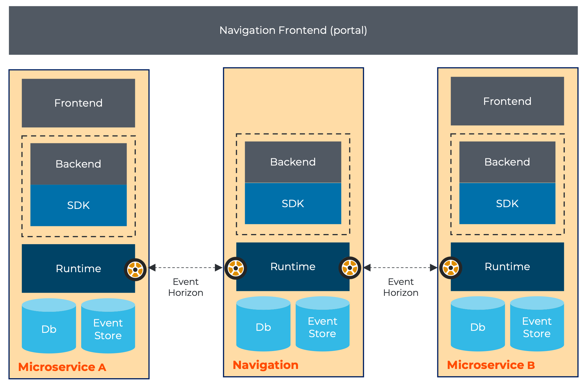
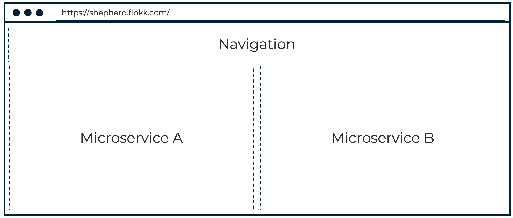
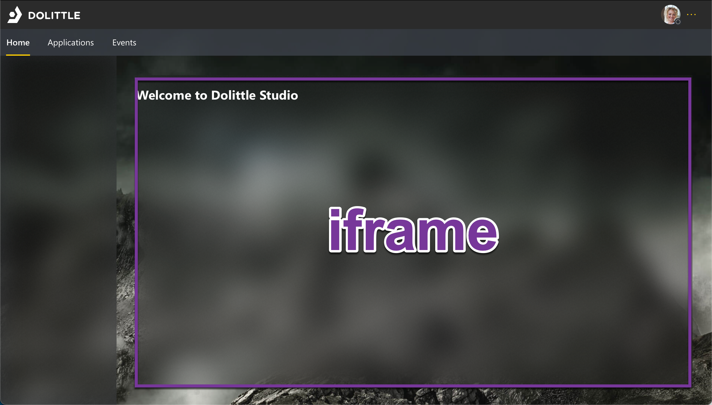
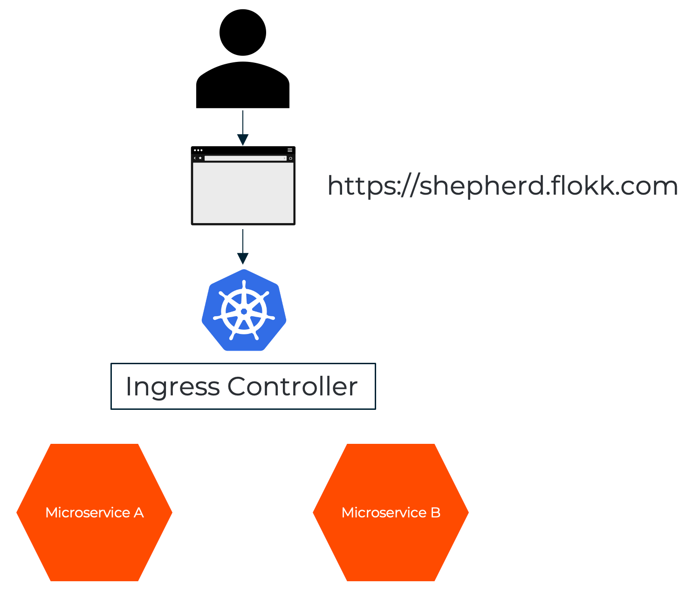

# Composition

When breaking up software into smaller parts as done in the Studio project with its
[autonomous microservice](./microservices.md) approach, you need to think about how
you bring it all back together in a good way for the end user to have a great experience.

Since every microservice is completely autonomous and release on their own cadence, you don't
want to create a system that needs coordination between teams / microservices in order to
release. You want this to be seamless and frictionless; a core promise of microservices.

The experience should be seamless for the implementors of the different microservices as well
as the end user experience, the end goal is something like below:

## iframes

The Web standard has a great feature to enable serving multiple different web pages within the
same page; [**iframes**](https://www.w3schools.com/tags/tag_iframe.asp).

Typically you'd want to have something like below:

The concrete sample of this is how we've chosen to do it in the Studio portal.

## Avoiding cross site

The decision of using iframes may come as a surprise, as it has attached to it a bit of
controversy related to security. This alleviated through composition on the ingress level.

For the browser, all the content seems to be coming from the same origin - but in reality
its redirecting traffic based on rules on the way into the hosted platform.

## Routing convention

Every microservice has been assigned a base route in the public. The convention for this is
`/_/<microservice>`. While from a portal routing perspective, the `/_/` segment is dropped
to provide the capability of deep linking. This makes it possible for the portal to host the
iframe and use URLs directly to any of the microservices it is responsible for hosting.

## Portal

Something needs to own the composition, within Studio we've called this the portal.
The portal is then the owner of the navigation structure, the look and feel and other
capabilities that should be accessible cross cuttingly in the solution.

The portal is responsible for maintaining a "mini SDK" - a package that contains the
functionality it exposes. By leveraging the built in eventing model of the browsers,
it communicates between the portal and whatever **iframe** is currently showing.