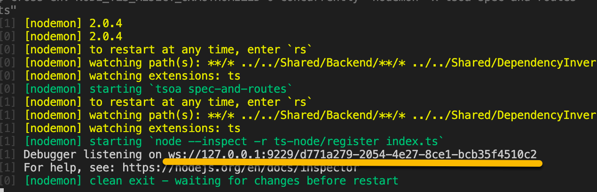
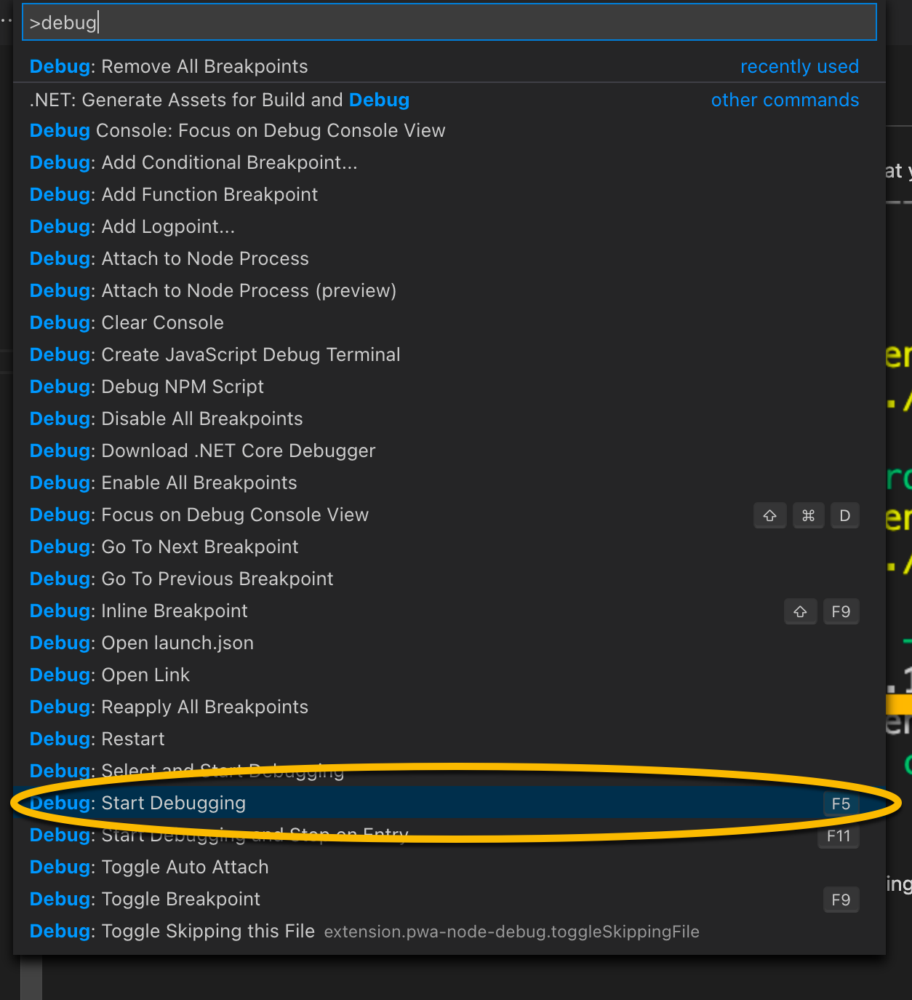
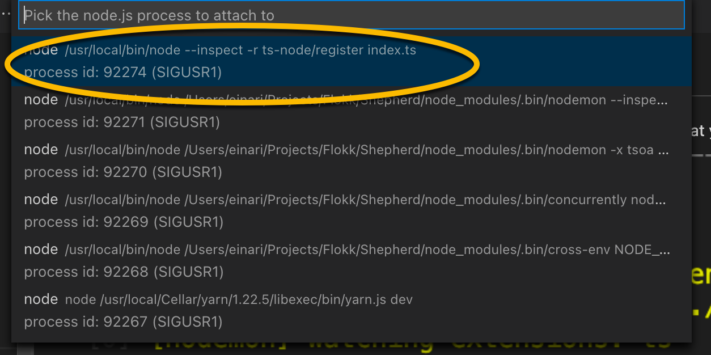

# Debugging

All projects are configured with running the `dev` script in debug mode. Meaning that you can run them and attach a debugger at any point in time.
You can see this in the console when running them:

They're configured to automatically pick the best port for the debugger.

For VSCode, there is a launch configuration that enables one to attach to any running process.
To do this, simply click F1 and type debugging or if you have the default key-bindings just click F5 directly:

Then you'll have to pick which process to debug:

Any of your breakpoints should now hit.
