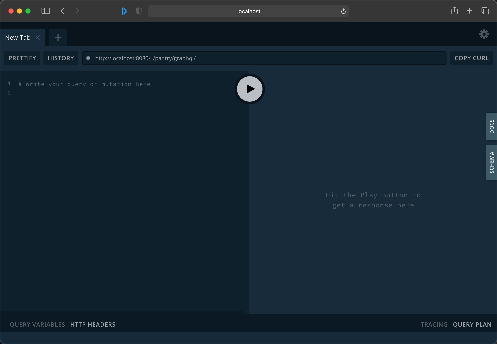

# GraphQL

All the backends expose for their frontends queries and mutations by leveraging [GraphQL](https://graphql.org).
[GraphQL](https://graphql.org) with [Apollo](https://www.apollographql.com) is what is set up in the
[@shared/backend](../Source/Shared/Backend) package available to all backends.

## Writing Query Resolvers

## Schemas

## Playground

All backends are set up using the [@shared/backend](../Source/Shared/Backend) package and offers an explorer served
at the `graphql` route of the microservice. With the environment running - as explained in the [getting started](./getting-started.md)
document, the explorer is available at the route for the microservice you're working with with the `graphql` segment appended
to the end: e.g. [http://localhost:9000/_/applications/graphql](http://localhost:9000/_/applications/graphql).



## Frontend

When using GraphQL in the frontend, there is a well defined interface you can take a dependency to; `DataSource`.
This is configured correctly with the Apollo Client and enables off the bat querying.
Available to all projects is a package called `graphql-tag`, which enables writing GraphQL queries directly in the
code and getting formatting in the editor but also the convenience of creating the necessary object graph to
query directly.

The ViewModels are typically the ones doing the heavy lifting on doing the queries, so for a ViewModel you can
do the following:

```typescript
import { DataSource } from '@shared/web';
import { injectable } from 'tsyringe';
import gql from 'graphql-tag';

@injectable()
export class MyViewModel {
    constructor(private readonly _dataSource: DataSource) {
    }

    async activate() {
        const query = gql`
            query {
                myQuery {
                    id,
                    name
                }
            }
        `;

        const result = await this._dataSource.query({query}):

        // Result has a property called data and on it the query name; result.data.myQuery
    }
}
```

The Apollo project has some good tutorials on queries as well that can be found [here](https://www.apollographql.com/docs/tutorial/client/#make-your-first-query).

## Desktop tooling

If you prefer having a desktop tool to work with trying out queries and mutations, you can find quite a few out there.
Example of this is [this](https://developer.aliyun.com/mirror/npm/package/graphiql-explorer) or [this](https://www.electronjs.org/apps/graphql-playground).
