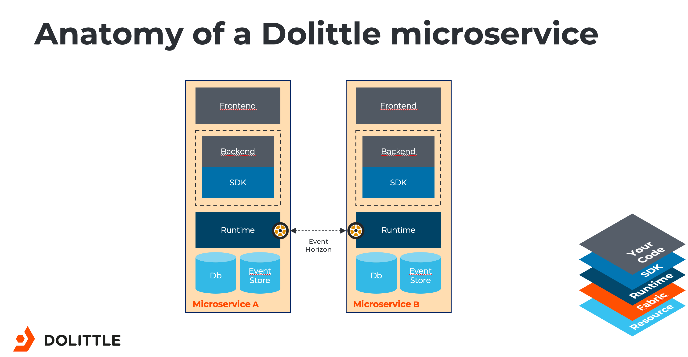

# Microservices

Everything in this project is built as Microservices. These are completely autonomous parts with an end to
end ownership of everything. This enables each module of the system to be completely decoupled from any other
part. At the core of each microservice sits the runtime services provided by Dolittle.

Communication between microservices is through events and not any point-to-point communication like APIs or similar.
The different microservices does not know about any of the other microservices. The communication is configured
for the runtime.

The solution consists of multiple microservices. Typically one develops on one of these at a time.
To get started with them, read below about what they are and how to get started.
