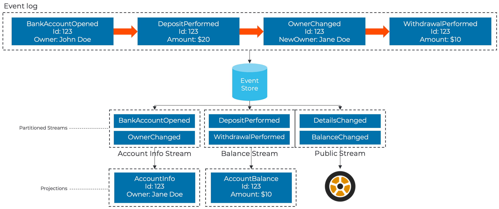

# Projections

Even though the truth of a system is represented as events in an [event sourced](./event-sourcing) system.
It does not make sense to run through all the events to present current state for a user or through an
API to another system. This would over time potentially slow down.

What you typically want to do is to take the "state in motion" - the events as they occur and create
a current reflection of the state. This process is known as projecting or creation of a projection.
This new projected state can then easily be queried.

Since this projected current state is not the source of truth of a system, we are free to create multiple
projections optimized for the purpose we want. The projection can be stored in the storage fit for purpose
as well, yielding an enourmous flexibility.

## Idempotency

When working with event sourced systems with an event store, like the Dolitte system is built around.
You need to think about the concept of being able to run through the events multiple times and reach
the same conclusion - or the same projected state. This concept is known as idempotency.

## Declarative

The task of converting the chopped up truth represented by the [events](./events.md) is somewhat repetitive in nature.
Tackling idempotency can be tricky and especially when one is doing projections that involves multiple
event sources and you're looking to compose to a projected state that is document oriented rather than
having to do relational lookups - often resulting in those dreaded N+1 queries and having to optimize
indexes between tables to get any **joins** fast.

In Studio, we're leveraging the Dolittle projection engine - which can read more about [here](https://github.com/dolittle-entropy/projections).
Its goal is to do the heavy lifting and make projecting to a current state effortless. You can read
on the API and usage [here](https://github.com/dolittle-entropy/projections/tree/main/Documentation).
There is also a sample [here](https://github.com/dolittle-entropy/projections/tree/main/Samples/Basic).

## Imperative

For some scenarios, you might not get what you want from the declarative approach and you will have to
revert to a more imperative approach - this is where you create a regular [event handler](./event-handlers.md)
and do what you want.

> Important: We prefer the declarative approach as it is more maintainable and gives a better opportunity
> for scaling out at runtime. So consider an imperative approach only if the declarative does not cover
> your needs.